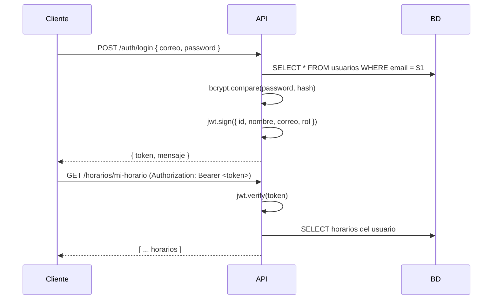

# ESPEConnect

[](https://developer.mozilla.org/en-US/docs/Web/Progressive_web_apps)
[](https://react.dev)
[](https://expressjs.com)
[](https://postgresql.org)
[](https://docker.com)

Plataforma universitaria PWA para la comunidad de la **Universidad de las Fuerzas Armadas ESPE — Sede Santo Domingo**. Conecta a estudiantes, docentes y administradores con los servicios del campus: horarios académicos, reserva de espacios, objetos perdidos y gestión administrativa.

> **Proyecto del Tercer Parcial** — Diseño y Desarrollo de Web Services, PWA, Despliegue mediante contenedores y CI/CD.

---

## Tabla de Contenidos

- [Arquitectura](#arquitectura)
- [Web Services RESTful](#web-services-restful)
- [PWA (Progressive Web App)](#pwa-progressive-web-app)
- [Despliegue](#despliegue)
- [Stack Tecnológico](#stack-tecnológico)
- [Estructura del Proyecto](#estructura-del-proyecto)
- [Instalación Rápida](#instalación-rápida)
- [Guía de Usuarios](#guía-de-usuarios)
- [API Endpoints](#api-endpoints)
- [Base de Datos](#base-de-datos)
- [Licencia](#licencia)

---

## Arquitectura

```
┌─────────────────────────────────────────────────────┐
│                   Cliente (PWA)                      │
│  React 19 + Vite + HeroUI + TanStack Query + Zustand │
│  Service Worker · Manifest · Offline Caching         │
└──────────────────────┬──────────────────────────────┘
                       │  /api/*  (HTTP / HTTPS)
                       ▼
┌──────────────────────────────────────────────────────┐
│            Backend (API RESTful)                      │
│  Express 5 · JWT · Routers · Middleware · Error Handler│
│  Arquitectura monolítica modular                      │
└──────────────────────┬───────────────────────────────┘
                       │  pg (node-postgres)
                       ▼
┌──────────────────────────────────────────────────────┐
│          PostgreSQL 18 · Base de Datos Relacional     │
│  Tablas: usuarios, nrc, horarios, asignaturas,       │
│  espacios_academicos, matriculas, reservas_espacios, │
│  notificaciones, objetos_perdidos                    │
└──────────────────────────────────────────────────────┘
```

### Principios de Diseño RESTful

| Principio | Implementación |
|-----------|---------------|
| **Recursos** | Cada entidad (usuarios, horarios, espacios, matrículas, reservas) tiene su propio endpoint |
| **Verbos HTTP** | `GET` (consulta), `POST` (creación), `PATCH` (actualización parcial), `DELETE` (eliminación) |
| **Códigos HTTP** | `200 OK`, `201 Created`, `400 Bad Request`, `401 Unauthorized`, `403 Forbidden`, `404 Not Found`, `409 Conflict`, `500 Internal Server Error` |
| **Stateless** | Cada request contiene toda la información necesaria (JWT en header `Authorization`) |
| **Rutas anidadas** | `/auth/me/contexto`, `/horarios/mi-horario`, `/matriculas/inscribir` |
| **Formato** | JSON en requests y responses. Fechas en ISO 8601 |

### Express: Routers, Middleware y Manejo de Errores

```
server/
├── routes/           # Routers modulares por recurso
│   ├── auth.routes.js        # /auth (login, register, contexto)
│   ├── horarios.routes.js    # /horarios (mi-horario, filtros)
│   ├── espacios.routes.js    # /espacios (CRUD, disponibilidad)
│   ├── matriculas.routes.js  # /matriculas (inscripción, cancelación)
│   ├── reservas.routes.js    # /reservas (solicitud, aprobación)
│   ├── notificaciones.routes.js
│   └── ai.routes.js          # /ai (chat con IA local)
├── middlewares/
│   ├── authentication.js     # Verifica JWT, inyecta req.usuario
│   └── authorization.js      # Rol-based access (admin)
└── index.js                  # Centraliza rutas, middleware global, error handler
```

**Middleware chain por request:**
1. `express.json()` → parsea body
2. `cors()` → permite origen del frontend
3. `authentication` → verifica token JWT
4. Route handler → lógica de negocio + query a BD
5. Error handler global → captura errores no controlados, responde con código y mensaje

---

## Web Services RESTful

### 3.1.1 Arquitectura de Web Services Autónomo

API RESTful implementada con Express 5 sobre Node.js 22+, desacoplada del frontend. Cada servicio es autónomo: maneja su propia lógica de negocio, validaciones y acceso a datos. Comunicación vía HTTP/JSON.

### 3.1.2 Principios de Diseño REST (Endpoints, Verbos, Códigos HTTP)

| Endpoint | Verbo | Uso | Códigos |
|----------|-------|-----|---------|
| `/auth/login` | POST | Inicio de sesión | 200, 400, 401, 404 |
| `/auth/register` | POST | Registro de usuario | 201, 400, 409 |
| `/auth/me/contexto` | GET | Contexto del usuario autenticado | 200, 401 |
| `/horarios/mi-horario` | GET | Horario personal (estudiante/docente) | 200, 403, 404 |
| `/horarios` | GET | Todos los horarios (con filtros) | 200 |
| `/espacios` | GET | Lista de espacios académicos | 200 |
| `/espacios/:id/disponibilidad` | GET | Disponibilidad por fecha | 200 |
| `/matriculas` | GET | NRCs disponibles para inscribir | 200, 400 |
| `/matriculas/inscribir` | POST | Inscribir NRC (valida choque horario) | 200, 400, 409 |
| `/matriculas/:id_nrc` | DELETE | Cancelar matrícula | 200, 404 |
| `/reservas` | GET/POST | Listar/Crear reservas | 200, 201, 400 |
| `/reservas/:id` | PATCH | Aprobar/Rechazar reserva (admin) | 200, 400, 403 |
| `/notificaciones` | GET | Notificaciones del usuario | 200 |
| `/ai/chat` | POST | Chat con IA local (Ollama) | 200, 500 |
| `/ai/status` | GET | Estado del servicio de IA | 200 |

### 3.1.3 Express: Routers, Middleware, Errores

Cada recurso tiene su propio router (`express.Router()`) montado en `server/index.js`. Middleware de autenticación global para rutas protegidas. Middleware de autorización para rutas admin. Error handler centralizado que captura `throw` y responde con `{ mensaje: "..." }` y código HTTP adecuado.

### 3.1.4 Conexión a Base de Datos

Pool de conexiones con `pg` (node-postgres) configurado vía variables de entorno. Conexiones reutilizables, consultas parametrizadas ($1, $2, ...) para prevenir SQL injection.

### 3.1.5 JSON Web Tokens (Práctica)



---

## PWA (Progressive Web App)

### 3.2.1 Conceptos (Autónomo)

La aplicación funciona como PWA: instalable en el dispositivo, con capacidad offline parcial, actualizaciones silenciosas y experiencia de usuario similar a una app nativa.

### 3.2.2 Service Worker y Manifest.json

- **Service Worker** generado automáticamente por `vite-plugin-pwa` con estrategia `generateSW`
- **Manifest:** nombre, íconos en múltiples resoluciones (192px, 512px, maskable), theme color, display standalone
- **Push notifications:** manejadas con `push-handler.js` y `Notification API`

### 3.2.3 Frameworks para Desarrollo de PWA

| Herramienta | Propósito |
|-------------|-----------|
| `vite-plugin-pwa` | Generación de Service Worker y manifest |
| `workbox` (vía vite-plugin-pwa) | Estrategias de caching: `NetworkFirst` para APIs, `StaleWhileRevalidate` para Google Fonts |
| Service Worker API | Interceptación de requests, precaching de assets |

### 3.2.4 Bibliotecas de Interfaz Enriquecida

| Librería | Uso |
|----------|-----|
| **HeroUI v3** | Componentes de UI (Button, Card, Input, Modal, Avatar, Chip, Checkbox) |
| **Framer Motion** | Animaciones y transiciones (drawer, modales, asistente IA) |
| **React Icons (Hi2)** | Iconografía (HeroIcons v2) |
| **Tailwind CSS v4** | Estilos utilitarios, diseño responsive |
| **Sonner** | Toast notifications |

### 3.2.5 Integración Frontend y Backend

```
Vite Dev Server (5173)          Express API (3000)
┌──────────────┐     proxy     ┌──────────────────┐
│  /api/*       ──────────────▶  │  /*               │
│              ◀──────────────│                  │
│  Axios        ◀──────────────│  JSON Response    │
│  baseURL: /api│              │                   │
└──────────────┘               └──────────────────┘
```

En producción, el build de Vite genera archivos estáticos servidos por Express o un contenedor Nginx.

### 3.2.6 Almacenamiento de Tokens (localStorage, IndexedDB)

| Mecanismo | Uso |
|-----------|-----|
| **localStorage** | Token JWT (`token`), datos de usuario (`usuario`), persistencia de Zustand (`espe-auth`, `espe-ui-store`) |
| **IndexedDB** | (vía Workbox) Caching de respuestas de API para offline |

---

## Despliegue

### 3.3.1 Despliegue mediante Contenedores

```yaml
# docker-compose.yml
services:
  db:
    image: postgres:18
    environment:
      POSTGRES_DB: espe_connect
      POSTGRES_PASSWORD: admin
    volumes:
      - pgdata:/var/lib/postgresql/data

  api:
    build: ./server
    ports:
      - "3000:3000"
    depends_on:
      - db
    environment:
      DB_HOST: db

  frontend:
    build: .
    ports:
      - "80:80"
    depends_on:
      - api
```

Tres contenedores: PostgreSQL 18 (base de datos), Express (API), y Nginx (frontend estático + proxy inverso a la API).

### 3.3.2 Pipelines en GitHub Actions o GitLab CI (Práctica)

```yaml
# .github/workflows/deploy.yml
name: Deploy ESPEConnect
on:
  push:
    branches: [master]
jobs:
  build-and-deploy:
    runs-on: ubuntu-latest
    steps:
      - uses: actions/checkout@v4
      - run: docker compose build
      - run: docker compose push
      - run: docker compose up -d
```

Pipeline automatizado: al hacer push a `master`, se construyen las imágenes Docker, se pushean a un registry y se despliegan en el servidor de producción.

### 3.3.3 Testing de la PWA (Autónomo)

Verificación de PWA mediante:
- **Lighthouse** (Chrome DevTools): puntuación en Performance, Accessibility, Best Practices, SEO, PWA
- **Pruebas offline**: Service Worker debe servir contenido cacheados sin conexión
- **Instalación**: El prompt `beforeinstallprompt` debe aparecer en navegadores compatibles
- **Responsive**: Diseño adaptable a móvil, tablet y escritorio

---

## Stack Tecnológico

### Frontend

| Tecnología | Versión | Propósito |
|------------|---------|-----------|
| React | 19 | UI declarativa basada en componentes |
| Vite | 8 | Bundler ultrarrápido, HMR |
| React Router | 7 | Enrutamiento SPA |
| TanStack Query | 5 | Fetching, caching y sincronización de datos |
| Zustand | 5 | Estado global liviano con persistencia |
| HeroUI | 3 | Componentes de interfaz accesibles y personalizados |
| Tailwind CSS | 4 | Estilos utilitarios |
| Framer Motion | 12 | Animaciones declarativas |
| Axios | 1 | Cliente HTTP con interceptores |
| vite-plugin-pwa | 1 | Service Worker + Manifest |

### Backend

| Tecnología | Versión | Propósito |
|------------|---------|-----------|
| Node.js | 22+ | Runtime JavaScript |
| Express | 5 | Framework HTTP con routers y middleware |
| jsonwebtoken | 9 | Autenticación stateless via JWT |
| bcrypt | 5 | Hashing de contraseñas |
| pg | 8 | Cliente PostgreSQL nativo |
| cors | 2 | Middleware de CORS |
| dotenv | 16 | Variables de entorno |
| nodemon | 3 | Recarga automática en desarrollo |

### Base de Datos

| Tecnología | Versión |
|------------|---------|
| PostgreSQL | 18 |
| pg (node-postgres) | 8 |

---

## Estructura del Proyecto

```
Proyecto/
│
├── public/                  # Assets estáticos (favicon, manifest icons)
│
├── src/                     # Frontend (React + Vite + PWA)
│   ├── api/
│   │   └── axios.js         # Cliente Axios con interceptors y baseURL
│   ├── components/
│   │   ├── auth/            # AuthCheckbox, PasswordRequirements
│   │   ├── assistant/       # AIAssistant, AssistantMessage
│   │   ├── common/          # NotificationDrawer, PushControls, PWAStatus
│   │   ├── layout/          # Layout, Sidebar, Header
│   │   ├── schedule/        # AgregarMateriaModal
│   │   └── spaces/          # ReservationModal
│   ├── pages/
│   │   ├── login/           # Inicio de sesión con accesos rápidos
│   │   ├── dashboard/       # Resumen de actividad
│   │   ├── schedule/        # Mi Horario (grid semanal 5 bloques × 5 días)
│   │   ├── academic-spaces/ # Espacios académicos con disponibilidad
│   │   ├── lost-objects/    # CRUD objetos perdidos/encontrados
│   │   ├── admin-spaces/    # CRUD espacios (solo admin)
│   │   ├── admin-reservations/ # Gestión de reservas (solo admin)
│   │   └── profile/         # Perfil de usuario
│   ├── services/            # Llamadas a la API (auth, horarios, espacios, etc.)
│   ├── store/               # Zustand (authStore, uiStore)
│   ├── routes/              # PrivateRoutes con role checking
│   ├── validation/          # Validación de formularios
│   └── constants/           # Constantes UI
│
├── server/                  # Backend (Express + JWT + PostgreSQL)
│   ├── routes/              # auth, horarios, espacios, matriculas, reservas, notificaciones, ai
│   ├── middlewares/          # authentication, authorization
│   ├── services/            # Lógica de negocio (usuario-context, ollama, notificaciones)
│   ├── database/            # conexion.js, migrate.js, seed-demo-users.js
│   ├── scripts/             # Scripts utilitarios
│   └── index.js             # Entry point: middlewares globales + rutas
│
├── database/                # SQL scripts
│   ├── schema.sql           # Creación de tablas, vistas, índices
│   ├── seed_horarios.sql    # Poblado de horarios, NRCs, asignaturas
│   ├── fix_horarios_jue_vie.sql
│   └── migrations/          # Migraciones incrementales
│
├── docker-compose.yml       # Orquestación de contenedores
├── Dockerfile               # Frontend container image
├── server/Dockerfile        # Backend container image
└── README.md
```

---

## Instalación Rápida

### Requisitos

| Herramienta | Versión |
|-------------|---------|
| Node.js | 22+ |
| PostgreSQL | 18 |
| npm | 10+ |
| Docker (opcional) | 24+ |

### 1. Clonar e instalar dependencias

```bash
git clone <url-del-repo>
cd Proyecto
npm install                    # Frontend
cd server && npm install && cd .. # Backend
```

### 2. Configurar base de datos

```powershell
$env:PGPASSWORD = "admin"
& "C:\Program Files\PostgreSQL\18\bin\psql.exe" -U postgres -c "CREATE DATABASE espe_connect;"
& "C:\Program Files\PostgreSQL\18\bin\psql.exe" -U postgres -d espe_connect -f database/schema.sql
& "C:\Program Files\PostgreSQL\18\bin\psql.exe" -U postgres -d espe_connect -f database/seed_horarios.sql
```

### 3. Iniciar servidores

```bash
# Terminal 1 — Backend (Express en :3000)
cd server && npm run dev

# Terminal 2 — Frontend (Vite en :5173)
npm run dev
```

### 4. Usuarios de prueba

| Rol | Correo | Contraseña |
|-----|--------|------------|
| Estudiante | `ceandrade@espe.edu.ec` | `espe2026` |
| Docente | `kjchuquitarko@espe.edu.ec` | `docente2026` |
| Admin | `admin@espe.edu.ec` | `admin2026` |

---

## Guía de Usuarios

### Estudiante
- **Mi Horario**: Visualiza tus materias matriculadas en grid semanal. Usa "Agregar Materia" para buscar NRCs disponibles e inscribirte (el sistema detecta choques de horario automáticamente).
- **Reservar Espacio**: Selecciona fecha, consulta disponibilidad (marcando franjas ocupadas por clases) y solicita reserva.
- **Objetos Perdidos**: Reporta objetos perdidos o encontrados, reclama objetos.
- **Perfil**: Datos personales, historial de reservas.

### Docente
- **Mi Horario**: Visualiza las materias que dictas en la semana (horarios completos Lun–Vie).
- **Reservar Espacio**: Igual que estudiante.
- **Chat IA**: Consulta al asistente local (Ollama) sobre espacios, horarios y servicios.

### Administrador
- **Gestión de Reservas**: Aprueba o rechaza solicitudes de reserva de espacios.
- **Administrar Espacios**: CRUD completo de espacios académicos.
- **Dashboard**: Estadísticas generales del sistema.

---

## API Endpoints

### Autenticación

```
POST   /auth/login              # { correo, password } → { token, mensaje }
POST   /auth/register           # { nombre, correo, password } → { mensaje }
GET    /auth/me/contexto        # → { usuario, carrera, periodo, horario_personal, ... }
```

### Horarios

```
GET    /horarios/mi-horario     # Horario del usuario autenticado
GET    /horarios                # Todos los horarios (filtros: periodo, espacio, docente, dia, carrera)
GET    /horarios/periodo-actual # Periodo académico activo
GET    /horarios/periodo/:id    # Horarios por periodo
GET    /horarios/espacio/:id    # Horarios por espacio
```

### Espacios

```
GET    /espacios                # Lista de espacios con filtros (tipo, capacidad, edificio)
GET    /espacios/:id            # Detalle de un espacio
GET    /espacios/:id/disponibilidad  # Disponibilidad por fecha (marca ocupado si hay clases)
```

### Matrículas

```
GET    /matriculas              # NRCs disponibles para inscribir (excluye los ya inscritos)
POST   /matriculas/inscribir    # { id_nrc } → inscribe, valida choque horario
DELETE /matriculas/:id_nrc      # Cancela matrícula activa
```

### Reservas

```
GET    /reservas                # Mis reservas
POST   /reservas                # { id_espacio, fecha, hora_inicio, hora_fin, motivo }
PATCH  /reservas/:id            # { estado, comentario_admin } (admin: aprobar/rechazar)
```

### Notificaciones

```
GET    /notificaciones          # Notificaciones del usuario
POST   /notificaciones/:id/leer # Marcar como leída
POST   /notificaciones/leer-todas  # Marcar todas como leídas
```

### Asistente IA (Ollama local)

```
GET    /ai/status               # Estado del servicio Ollama
POST   /ai/chat                 # { question, history[] } → { answer }
```

---

## Base de Datos

### Diagrama de Tablas Principales

```
usuarios ────┬─── matriculas ──── nrc ──── asignaturas
             │                                  │
             ├─── reservas_espacios ──── espacios_academicos
             │                                  │
             ├─── objetos_perdidos       tipos_espacio
             │
             └─── notificaciones

nrc ──── horarios ──── espacios_academicos
  │
  └─── docentes
```

### Vistas

- **`vista_horarios_completa`**: JOIN de horarios + nrc + asignaturas + docentes + espacios + periodos. Usada por los endpoints de horarios. Incluye `dia_semana` (1–5), `hora_inicio`, `hora_fin`, `codigo_asignatura`, `docente`, `codigo_espacio`, `nivel_pao`, `paralelo`.

### Periodos Académicos (PAO)

La carrera Tecnología de la Información (ITIN) contempla 8 PAOs más la Unidad de Integración Curricular (MIC). Cada PAO tiene materias con horarios distribuidos en bloques de 2 horas:

| Bloque | Horario |
|--------|---------|
| 1 | 07:00 – 09:00 |
| 2 | 09:00 – 11:00 |
| 3 | 11:00 – 13:00 |
| 4 | 13:00 – 15:00 |
| 5 | 15:00 – 17:00 |

Días: Lunes a Viernes. Campus: ESPE Santo Domingo. Edificios: Bloque 1 y Bloque 2 (un solo piso).

---

## Créditos

**Proyecto desarrollado para la carrera de Tecnología de la Información (ITIN)**  
Universidad de las Fuerzas Armadas ESPE — Sede Santo Domingo  
Período Académico 202650 (MAR 2026 – AGO 2026)

**Tercer Parcial — Unidades:**
- 3.1 Diseño y Desarrollo de Web Services (API RESTful con Express + JWT)
- 3.2 PWA (Service Worker, Manifest, Offline, HeroUI)
- 3.3 Despliegue (Contenedores Docker, CI/CD con GitHub Actions)
- Proyecto integrador fullstack con despliegue automatizado

---

## Licencia

Uso educativo — ESPE 2026
